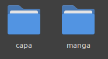
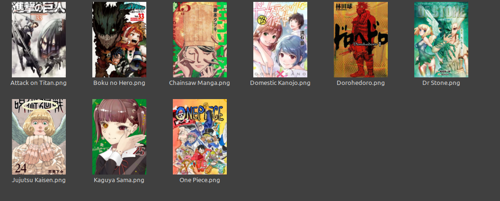
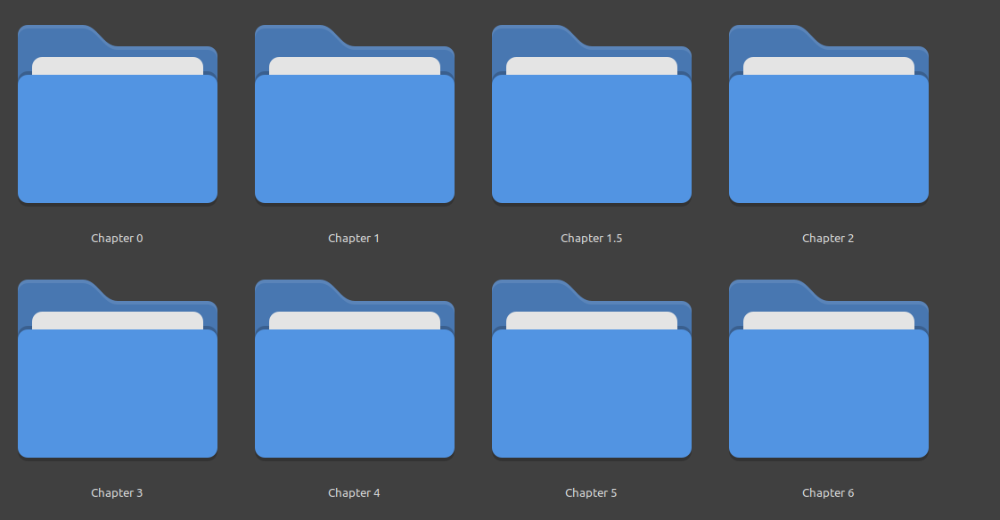
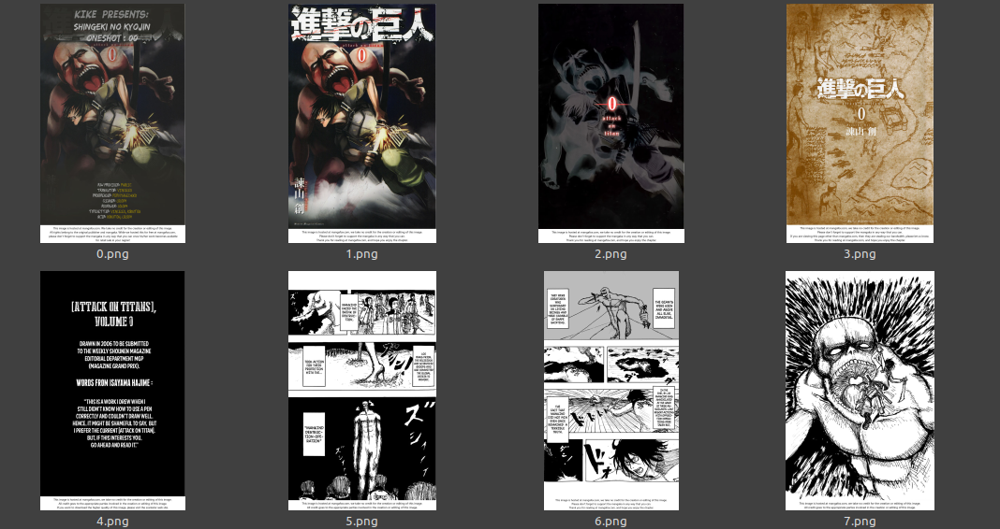

# MangaReader

## Biblioteca

  O programa inicia sempre pela biblioteca do usuário. Nela é possível visualizar e navegar por todos os mangas
disponíveis, também é possível favoritar um manga para que ele apareça primeiro que os outros no catálogo.

##  Navegação

> Utilize as teclas de direção para percorrer o catálogo.

> A tecla Enter é utilizada para escolher um mangá para leitura.

> A tecla 'F' favorita ou desfavorita um mangá no catálogo.

## Mangas e imagens de capa

####  Adição de Capas

>Adicione imagens de capa colocando-as na pasta /mangas/capa.
O nome da imagem de capa do manga deve ser exatamente o mesmo que o nome do manga.

####  Adição de Mangás

> Adicone mangas colocando-os na pasta /mangas/manga

# Tela de leitura

Na tela de leitura será possível ler o manga escolhido, o programa lembra do ultimo capitulo lido de cada 
manga.

>Utilize as teclas de direção <- e -> para alternar entre os capitulos.

>Utilize as teclas de direção (cima) e (baixo) para mover as páginas.

>A tecla Escape retorna à biblioteca.

# Requisitos

- Linux
- [SFML](https://www.sfml-dev.org/tutorials/2.6/start-linux.php)
- g++

# Compilação

    make

# Execução

    ./build/apps/manga_reader.out
  

# Exemplo de utilizaçao

Dentro da pasta [mangas](mangas) crie as seguintes pastas

Na pasta **capa** coloque as imagens de capa como na imagem

Na pasta manga coloque os mangas

O nome em cada imagem deve ser exatamente o mesmo
que o nome na pasta correspondente de seu manga

Dentro de cada pasta de cada manga estão uma pasta
para cada capitulo, é importante que **cada capitulo tenha um número associado** para seja possível ler o manga em ordem.

Exemplo: Dentro da pasta de Attack on Titan existe uma pasta para cada capitulo e cada pasta tem o número do capitulo em seu nome

Dentro de cada pasta de cada capitulo as imagens devem estar enumeradas em uma ordem que reflita a ordem de leitura das imagens

