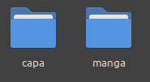
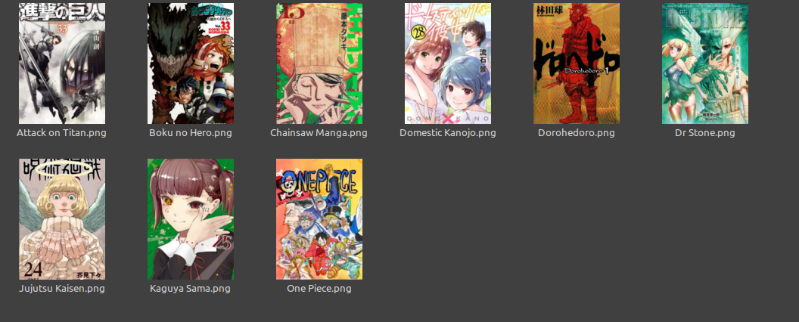
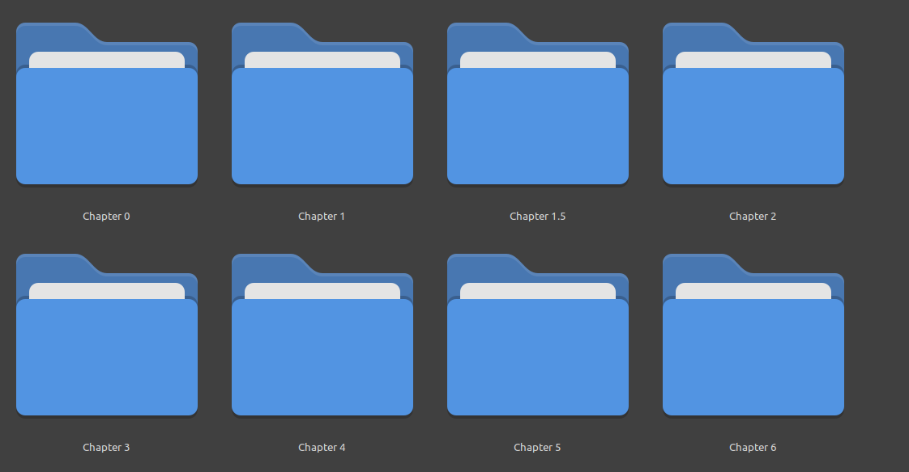

# Exemplo de utilizaçao

Dentro da pasta [mangas](mangas) crie as seguintes pastas

Na pasta **capa** coloque as imagens de capa

Na pasta manga coloque os mangas

O nome em cada imagem na pasta **capa** deve ser exatamente o mesmo
que o nome na pasta correspondente de seu manga

Dentro de cada pasta de cada manga estão uma pasta
para cada capitulo, é importante que **cada capitulo tenha um número associado** para seja possível ler o manga em ordem.

Exemplo: Dentro da pasta de Attack on Titan existe uma pasta para cada capitulo e cada pasta tem o número do capitulo em seu nome

Dentro de cada pasta de cada capitulo as imagens devem estar enumeradas em uma ordem que reflita a ordem de leitura das imagens

